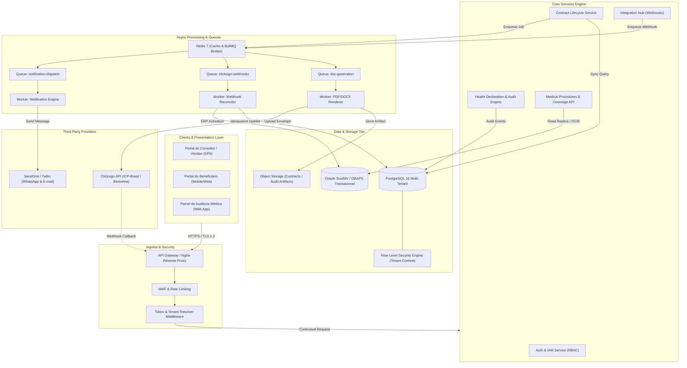

import os

content = r"""# 🏥 HealthFlow SaaS — Enterprise Contract Lifecycle & Clinical Governance Platform

Plataforma SaaS corporativa de alta disponibilidade projetada para orquestrar o ciclo completo de onboarding, emissão de contratos digitais, validação biométrica de declarações de saúde e regulação assistencial para operadoras de planos de saúde, administradoras de benefícios e cooperativas médicas.

A solução substitui fluxos analógicos e silos legados por uma esteira distribuída orientada a eventos, com isolamento multi-tenant rigoroso, integrando regras regulatórias da ANS, assinatura digital com validade jurídica e sincronização bidirecional com grandes ERPs hospitalares (SoulMV / DBAPS).

---

## 💼 1. Visão do Negócio

### O Problema
No setor de saúde suplementar, a esteira de contratação enfrenta gargalos críticos:
* **Assimetria de Informações e Fraude:** Omissão de doenças preexistentes em declarações de saúde sem rastreabilidade de IP, metadados ou biometria.
* **Fricção Comercial e Churn Prematuro:** Vendedores travam negociações ao não possuírem visibilidade em tempo real sobre tabelas TUSS, portes anestésicos e coberturas do Rol ANS.
* **Quebra de SLAs e Extravio de Minutas:** Contratos físicos ou processos manuais demoram dias para coleta de assinaturas, conciliação e ativação no faturamento.
* **Complexidade Regulatória (ANS / LGPD):** Falta de auditoria imutável sobre cada etapa de consentimento e aceite de dados sensíveis de saúde.

### A Solução Arquitetada
O **HealthFlow SaaS** atua como uma camada inteligente de governança comercial e clínica:
1. **Geração Dinâmica de Contratos:** Renderização sob demanda de minutas contratuais PDF/DOCX baseadas em dados preenchidos pelo consultor e beneficiário.
2. **Esteira de Declaração de Saúde com Zero-Trust:** Questionários dinâmicos com auditoria de biometria facial, controle de recusa e validação técnica por médicos auditores.
3. **Orquestração de Assinaturas (Clicksign API):** Disparo automático de envelopes com múltiplos signatários (titular, dependente, contratante PJ, testemunhas e operadora), monitorados via webhooks idempotentes.
4. **Integração Nativa com ERP SoulMV:** Ingestão e conciliação direta com tabelas transacionais (`DBAPS.V_PROCEDIMENTO`, `DBAPS.PROPOSTA`, etc.), garantindo ativação financeira instantânea.

---

## 🏗️ 2. Diagrama de Arquitetura (Flowchart TD)

---

## 🤝 3. Engenharia de Soluções & Consultoria

Projetado e arquitetado por **Yan Douglas Barbosa**.

*Especialista em modernização de plataformas corporativas, arquiteturas multi-tenant de alta volumetria e esteiras de integração complexas para os setores de Healthtech, FinTech e Seguros.*

* 🏛️ **Arquitetura de Soluções:** Desenho e refatoração de ecossistemas legados para SaaS distribuído.
* 🔄 **Governança e Integrações:** Conectividade de alta performance com ERPs hospitalares (SoulMV, Tasy), gateways de assinatura eletrônica e mensageria.
* 🛡️ **Segurança e Conformidade:** Modelagem de dados com isolamento RLS, Zero-Trust e adequação total à LGPD e normas regulatórias.

### 📬 Entre em contato para consultorias e projetos estratégicos:

* **LinkedIn:** [linkedin.com/in/yan-douglas](https://www.linkedin.com/in/yan-douglas-barbosa-708112353/)
* **E-mail Corporativo:** [yan.barbosa@plasc.org.br](yan.barbosa@plasc.org.br) &bull; [yan.programsxz@gmail.com](mailto:yan.programsxz@gmail.com)
* **GitHub:** [@yandouglas]([https://github.com/yandouglas](https://github.com/yandouglas))

---

  © 2026 Yan Douglas Barbosa &mdash; Engenharia de Software e Arquitetura de Soluções.

"""

target = r'\\172.18.5.219\htdocs\plasc-contratos\README.md'
with open(target, 'w', encoding='utf-8') as f:
    f.write(content)

print("README.md gravado com sucesso! Tamanho final:", len(content))
